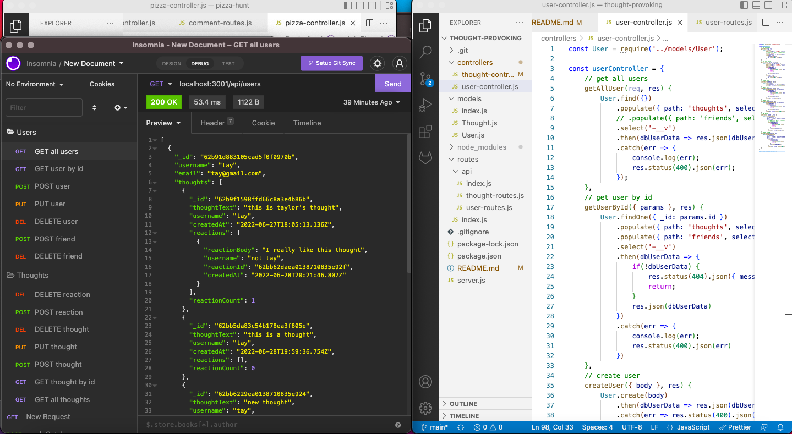

# Thought Provoking

## Description

This application uses MondoDB and Mongoose to create a backend social medie application called Thought Provoking. Users can create new users for the social media page and can make other users their friends. Each user can also create a 'thought' and each thought can have a reaction to it in the comments. This facilitates an interactive experience among users and friends to share their thoughts and to be able to have a conversation about it.

## Installation

To use this application the user must first git clone this repository. Once they have the files of this repository on their system they must then (while in the repository's root directory) run `npm install` in the command line to be able to connect to the database. 

## Usage

When the user is ready to start the application they will run `npm start` in the command line to start the server. The user can then open Insomnia or another application used to test routes and test each of the routes, create users, friends, thoughts and reactions. It is suggested that the user go to the user-routes.js and thought-routes.js to see what the address is for each route.

## Demo

To see a demonstration of this application please click [here](https://drive.google.com/file/d/18hLPwBiv4uxjjU7cjr343AgUP5c9eJsD/view?usp=sharing) and [here](https://drive.google.com/file/d/1iN1W05z0U3RLTnu84Z3AGpFE8t2XADoO/view?usp=sharing) for parts 1 and 2.